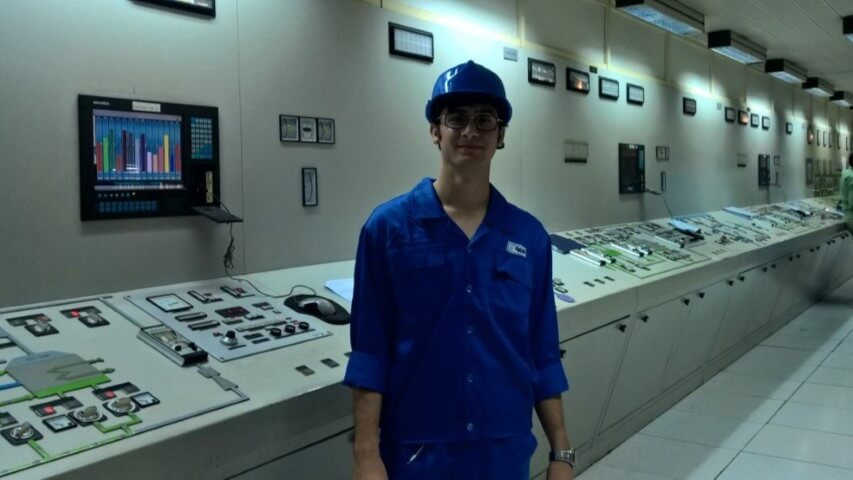
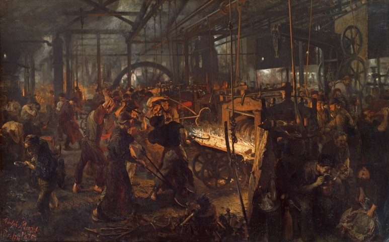

Years ago, I worked at Mobarakeh Steel Company near Isfahan.

What stayed with me was not the scale of the machinery, but the people who kept it running: operators, technicians, engineers, drivers, contractors and thousands of families whose lives were tied to that place.

> **A factory is never just a factory.**

It is wages, food, rent, education and security. It connects workers with suppliers, transport companies, workshops and entire communities. When it is attacked, the damage does not stop at the factory gates. It spreads through society, while those with the least power carry the greatest cost.

Iranian people have already paid heavily for demanding dignity, freedom and basic rights. The violent repression they have faced at home must not be ignored.

After decades of repression and the failure of peaceful paths to change, some Iranians placed their hope in support from abroad. They may have misjudged what such support would bring, but they did not create the interests, military plans or political calculations that led to these attacks.

> **Ordinary Iranians are not responsible for the repression imposed on them or the wars waged over them.**

Iran’s authorities are responsible for the repression and warmongering that created such desperation and war. Those who plan, authorise and carry out military attacks remain responsible for their destruction. Foreign powers had their own objectives long before desperate people called for intervention. Ordinary Iranians should not be blamed for either.

Their hope for freedom was absorbed into the interests of more powerful actors and used to justify actions that may leave the same people poorer, less secure and further from freedom.

> **Destroying a country’s workplaces and infrastructure does not free its people.**

Those who hold power usually protect themselves. Workers lose income. Families face uncertainty. Communities become weaker. The people already carrying the burden are asked to carry more.

No government has the right to silence its people. No foreign power has the right to present their suffering as the price of liberation.

<small class="article-image-credit">Adolph Menzel, *The Iron Rolling Mill (Modern Cyclopes)*. Image source: Google Art Project.</small>

A steel plant is built through generations of labor, knowledge and sacrifice. Its value does not belong only to those who formally control it. It belongs, in a deeper sense, to those whose work created it and whose lives depend on it.

This principle should also shape how we understand solidarity.

The world is witnessing brutal destruction in many places. Concern for distant suffering matters, but it becomes hollow when it replaces responsibility for the injustice within our own reach.

> **Solidarity should connect distant concern with responsibility close to home.**

When powerful institutions treat people as expendable, we must first recognize who bears the real cost. Solidarity means standing with workers, families and communities, not turning their suffering into justification for another form of violence.

Iran will not be freed by silencing its people, nor by destroying the workplaces and infrastructure on which they depend. Its future must be built by people who understand that their lives are connected and that no one’s suffering should become another person’s political instrument.

> **In the end, we have each other.**

That is where resistance begins.

That is where rebuilding begins.
