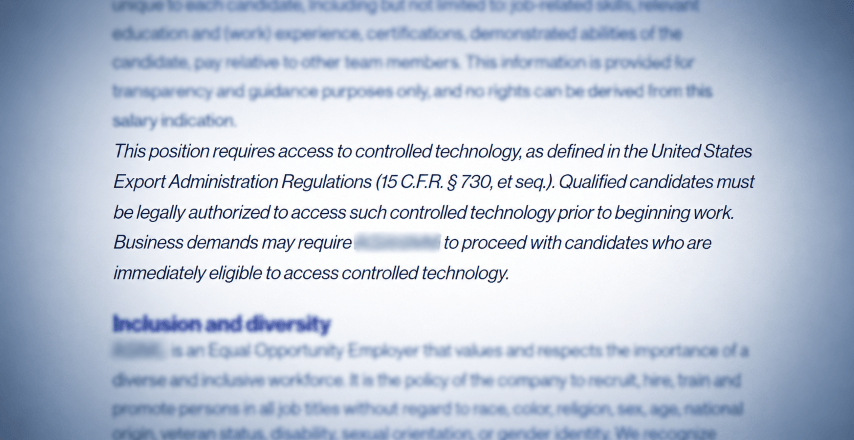

## When Exclusion Becomes Identity

<p class="article-quotation">“I was rejected because I am Iranian.”</p>

I have said this myself. Many Iranians have said it after a recruitment process stopped when nationality entered the conversation. The sentence describes a real experience, but it also performs a subtle shift: the employer, the hiring manager, the regulation and the corporate decision disappear. What remains is “Iranian,” as though our nationality itself caused the rejection.

> **When we remove those decision-makers from the sentence, the exclusion remains, but the people responsible for it disappear.**

Karen E. Fields and Barbara J. Fields describe a similar process in Racecraft. They examine the famous common statement:

<p class="article-quotation">“Black Southerners were segregated because of their skin color.”</p>

The sentence sounds descriptive, but its grammar conceals the people and institutions that imposed segregation. An organised system of exclusion reappears as though it were a consequence of the people being excluded. Racist action produces the apparent reality of race, and then race is presented as the explanation for that action.[^1]


<small class="article-image-credit">When identity is made to signify danger, exclusion begins before the individual is known. Bahman Mohassess, *Il Minotauro fa Paura alla Gente per Bene*, 1966.</small>

Race is not a natural fact waiting to be discovered. It is produced when institutions repeatedly treat a human distinction as evidence of something inherent. In this case, Iranian nationality can be made to signify political allegiance, security risk or professional unsuitability. Nationality is then made to function as race.

I see this process in employment. A recruiter refers vaguely to “American technology,” “sanctions” or “export controls.” The process ends, and we say:

<p class="article-quotation">“They do not hire Iranians.”</p>

Or:

<p class="article-quotation">“I was rejected because I am Iranian.”</p>

The frustration is justified. Some positions genuinely involve controlled technology whose release to an Iranian national may require US authorisation. But US export-control rules regulate access to particular controlled technology; they do not generally prohibit the employment of foreign nationals.[^2] Whether a person can perform a role may therefore also depend on how the company interprets the rules, whether it considers licensing, whether access can be separated and whether alternative responsibilities are possible.

When we say only, “I was rejected because I am Iranian,” Iranian nationality appears to have caused the rejection. The decision-makers, regulations and corporate choices disappear. “Iranian” gradually begins to sound like an inherent professional limitation rather than the object of a policy imposed by others.

A more accurate description would be:

<p class="article-quotation">“The hiring team appears to have excluded me based on its interpretation of the company’s export-control policy.”</p>

This wording does not deny discrimination. It locates it. It also leaves open the question of whether the policy was necessary, correctly interpreted or applied more broadly than the law required.

### When a Narrow Rule Becomes a System

The distinction matters because a narrow compliance requirement can easily become a general hiring shortcut. In the Netherlands, nationality is a protected ground, and employers generally may not exclude applicants merely because of their passport.[^3] Dutch human-rights decisions distinguish between a demonstrated restriction affecting a particular position and exclusion based on assumptions that were never individually verified.[^4]



<small class="article-image-credit">When a narrow compliance clause becomes a broader gatekeeping tool.</small>

Yet once nationality restrictions become normalised, their effects can spread beyond the original position. A hiring manager may reject someone because a future client might object. A secondment agency may decide that an Iranian candidate is harder to place. Contractors and subcontractors may adopt stricter internal rules than their clients or the law actually require. One Dutch ruling concerned precisely such a situation: an Iranian applicant was rejected by a technical secondment agency after broad references to clients working with American companies, without a demonstrated legal exception for the position.[^5]

> **A narrow compliance rule can become a system of exclusion long after its original justification has disappeared.**

The result is not merely a series of isolated decisions. It is a self-reinforcing employment structure in which Iranian professionals are treated as less deployable before the actual role has been assessed.

This also changes the recruitment process itself. Other candidates can begin by asking:

<p class="article-quotation">“What work do I want to do?”</p>

Iranian candidates are often forced to ask:

<p class="article-quotation">“What work am I permitted to do?”</p>

Yet they are usually expected to navigate the same recruitment process without being told which positions are restricted, which regulation applies or whether another arrangement is possible. An identical procedure is not necessarily a fair one when one group is required to carry additional institutional uncertainty.

Companies working with controlled technology should therefore provide a transparent compliance pathway. Possible restrictions should be identified early, each role should be assessed individually, and licensing, controlled access or alternative responsibilities should be considered before a candidate is excluded. US export-compliance guidance itself discusses licensing, technology-control plans and internal access controls for foreign-national employees.[^6]

```python
def hiring_pipeline(candidates):
    while candidates:
        candidate = candidates.pop(0)

        if inclusion_and_diversity():
            if exclusion_and_hypocrisy():
                if exclude_candidate_based_on_nationality(candidate):
                    log_decision(
                        candidate,
                        reason="After careful consideration ...",
                    )
                    continue
            return continue_with_fair_evaluation(candidate)
    return exit_process()

def exclusion_and_hypocrisy():
    return True
```

<small class="article-image-credit article-image-credit--spaced">How repeated nationality-based decisions become systemic, bury their original justification, and turn compliance into a reusable tool of exclusion.</small>

Nationality screening may sometimes satisfy a specific legal obligation, but it should not be confused with a complete security assessment. Information can be compromised by people of any nationality. Effective protection also requires controlled access, monitoring and individual accountability.[^7] When that distinction is lost, a narrow compliance measure can become systemic: copied across organisations, widened beyond its original purpose and reused as a general tool of exclusion.

> **Iranian citizens are not extensions of the Iranian government.**

In fact, many are among those most directly harmed by its decisions.[^8] When institutions abroad impose additional burdens on them, those decisions should be named without turning “Iranian” into an explanation for exclusion.

Changing our language will not remove the barrier. But it can prevent the barrier from becoming part of how we describe ourselves.

**We are not rejected by our nationality. We are excluded by decisions made about it—and those decisions must remain visible and open to challenge.**

[^1]: Karen E. Fields and Barbara J. Fields, *Racecraft: The Soul of Inequality in American Life*, particularly their discussion of how the statement about the segregation of Black Southerners transforms an institutional action into an apparent characteristic of its targets. [Read the relevant text](https://analepsis.org/wp-content/uploads/2017/08/barbara-j-fields-and-karen-fields-racecraft-the-soul-of-inequality-in-american-life.pdf).

[^2]: US Bureau of Industry and Security, [Iran Export Controls](https://www.bis.gov/licensing/country-guidance/iran-export-controls) and [Deemed Export FAQs](https://www.bis.gov/media/documents/deemed-exports-faqs.pdf). BIS states that releasing certain controlled technology or software to Iranian nationals may require a license, but that the Export Administration Regulations do not prohibit or regulate the employment of foreign nationals.

[^3]: US Bureau of Industry and Security, [Deemed Export Licensing Guidelines for Foreign Persons](https://www.bis.gov/sites/default/files/documents/deemed-exports-licensing-guidelines-foreign-persons.pdf) and [The Elements of an Effective Export Compliance Program](https://www.bis.gov/sites/default/files/documents/ECP_0.pdf). The guidance addresses license applications, technology-control plans and internal access controls for foreign-national employees.

[^4]: UK National Cyber Security Centre, [Reducing Data Exfiltration by Malicious Insiders](https://www.ncsc.gov.uk/guidance/reducing-data-exfiltration-by-malicious-insiders). The guidance emphasizes organizational, procedural and technical controls for managing insider threats.

[^5]: Government of the Netherlands, [Prohibition of discrimination](https://www.government.nl/themes/migration-and-travel/discrimination/prohibition-of-discrimination). Dutch law recognizes nationality as a protected ground and prohibits unequal treatment under equal circumstances.

[^6]: Netherlands Institute for Human Rights, [Ruling 2025-49](https://oordelen.mensenrechten.nl/oordeel/2025-49/132a89f8-0a5c-4fd6-9ab1-aefd8b904d80), where an applicant was unlawfully excluded based on an unverified assumption about security screening; and [Ruling 2026-42](https://oordelen.mensenrechten.nl/oordeel/2026-42/03a1c1ef-1799-4449-94d8-6dc84786be0a), where a narrowly defined nationality restriction was accepted after the employer demonstrated a concrete conflict with US export-control requirements.

[^7]: Netherlands Institute for Human Rights, [Ruling 2020-8](https://oordelen.mensenrechten.nl/oordeel/2020-8). A technical secondment agency unlawfully rejected an Iranian applicant after referring broadly to clients that worked with American companies, without demonstrating that a legal exception applied to the position.

[^8]: UN Office of the High Commissioner for Human Rights, [Iran: Government Continues Systematic Repression and Escalates Surveillance](https://www.ohchr.org/en/press-releases/2025/03/iran-government-continues-systematic-repression-and-escalates-surveillance).
