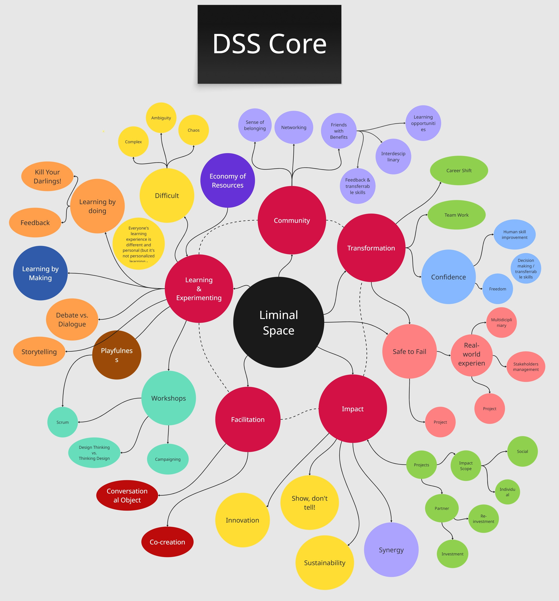

## DSS Final Prototype Presentation

How can ten years of impact, collaboration, and learning be captured together - not as a booklet or a website, but as an interactive experience? And how can such an experience carry the spirit of this new way of learning to the next generation of users?

Months of desk research, field research, interviews, surveys, and co-creation sessions led us to one phrase: **Liminal Space**.

Yes, you heard it correctly. Digital Society School is a liminal space in many ways. It is a place where people grow professionally and transform into a new version of themselves. It provides the tools and environment needed to develop and deliver continuously - from CNC machines and 3D printers to a space for experimentation, collaboration, and creation.

At DSS, you expand your network. You experience real ownership, work directly with stakeholders, and manage challenges that push the limits of your skills in ways you would rarely encounter before becoming a senior owner in your career. This is where transformation happens.

So we preserved that spirit through a liminal prototype: a digital virtual building where users can interactively explore the DSS experience. It brings together the learning features, partners, projects, impacts, people you know, and people you may want to know.

Accessible from anywhere, the prototype celebrates the achievements of the past ten years while leaving behind a legacy for those who want to grow in their personal and professional lives.

## LinkedIn Video

<iframe class="linkedin-embed" src="https://www.linkedin.com/embed/feed/update/urn:li:activity:7475156637666766848" height="620" width="100%" frameborder="0" allowfullscreen="" title="DSS Final prototype presentation LinkedIn video"></iframe>

You can follow the story of what we built over the last six months, step by step, through our project page:

<a class="link-preview-card" href="https://digitalsocietyschool.org/project/the-thread/" target="_blank" rel="noopener noreferrer">
  
    
  
  
    The Thread - The DSS Legacy Project
    Ten Years, A New Horizon: The Metamorphosis of DSS. The Digital Society School did not just build a curriculum over the last decade. It built a community of deep empathy, messy experimentation...
    digitalsocietyschool.org
  
</a>
